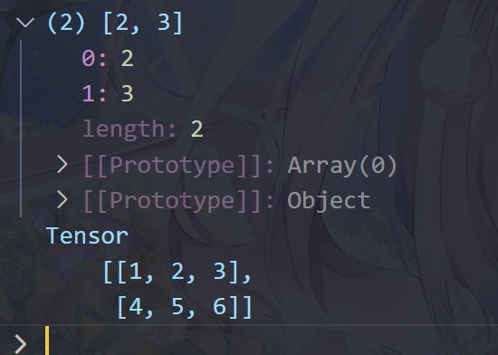

# 使用TensorFlow.js进行手写识别MLP网络训练

## TensorFlow.js简介

TensorFlow是一个由Google开发的开源机器学习框架，用于构建和训练各种机器学习模型。它提供了一个灵活的、易于使用的工具集，使开发者能够构建各种深度学习模型，包括神经网络和其他机器学习算法。TensorFlow具有广泛的应用领域，包括自然语言处理、计算机视觉、语音识别、推荐系统等。TensorFlow还提供了丰富的工具和库，如TensorBoard用于可视化模型训练过程，TensorFlow Serving用于部署模型，TensorFlow Lite用于在移动设备和嵌入式系统上运行模型等。

TensorFlow.js则是个基于JavaScript的开源库，用于在浏览器和Node.js环境中训练和部署机器学习模型。它允许开发者使用JavaScript语言来构建、训练和运行机器学习模型，从而使得机器学习变得更加容易和便捷。

TensorFlow.js支持在浏览器中直接加载和运行预训练的模型，也支持在客户端进行实时的模型推理，例如在Web应用中进行实时图像识别、语音识别等。此外，TensorFlow.js还支持在浏览器中进行模型训练，使得开发者可以利用用户的本地计算资源来进行训练，而无需依赖于远程服务器。TensorFlow.js的灵活性和跨平台特性使得它成为了一个受欢迎的机器学习工具，特别适用于Web开发和移动应用开发领域。

TensorFlow.js总共有三个开源项目：

- `tfjs`
- `tfjs-node`
- `tfjs-node-gpu`

其中`tfjs`内容最精简，适合用于浏览器端部署，但是与之相反，性能也是最弱的；`tfjs-node`和`tfjs-node-gpu`则是为node端定制的，适合假设在个人PC或者服务器端中运行，前者使用cpu进行计算，后者则调用gpu进行计算，仅支持NVIDIA GPU，并且需要Cuda以及CUDNN软件环境。

本文使用最简单的`tfjs`进行项目搭建，其他项目只是配置起来略微复杂，代码逻辑层面并不会有太大的不同。

## MLP模型简介

多层感知机（MLP，Multilayer Perceptron），是一种基本的人工神经网络（ANN，Artificial Neural Network）模型。它由多个神经元组成，通常包括一个输入层、一个或多个隐藏层以及一个输出层。

每个神经元通常都与前一层的所有神经元相连，每条连接都有一个权重。在多层感知机中，每个神经元接收上一层神经元的输出，并将其加权求和后通过一个激活函数进行处理，以产生该神经元的输出。这个输出通常作为下一层神经元的输入。

多层感知机之所以称为“多层”，是因为它至少包含一个以上的隐藏层。这些隐藏层允许模型学习复杂的非线性关系，使得多层感知机能够适应各种复杂的任务。

## 预备工作

我们会使用Node.js进行调试和运行，因此需要提前安装node。从node官网获取并下载。

首先新建项目文件夹:

```cmd
mkdir tfjs-handwriting
cd tfjs-handwriting
```

初始化项目：

```cmd
npm init
```

我们需要用到三项依赖：

- `tfjs`：用于训练并使用神经网络
- `mnist`：mnist数据集，作为训练数据
- `canvas`：对结果进行绘图

从node官网中下载并安装完node后，会附带一个包管理工具`npm`。我们使用`npm`进行依赖的安装：

```cmd
npm install @tensorflow/tfjs mnist canvas
```

如果下载较慢可以用专门使用淘宝镜像的`cnpm`进行下载。

使用如下命令：

```cmd
npm list
```

列出当前项目中已经下载好的依赖，检查依赖是否有问题。正常情况下，会显示类似如下内容：


`node_module`目录情况：


`package.json`文件：

```json
{
  "name": "tfjs-handwriting",
  "version": "1.0.0",
  "description": "This is a project for the training of handwriting recognition neural network.",
  "main": "index.js",
  "scripts": {
    "test": "echo \"Error: no test specified\" && exit 1"
  },
  "author": "Yuki",
  "license": "ISC",
  "dependencies": {
    "@tensorflow/tfjs": "^4.19.0",
    "canvas": "^2.11.2",
    "mnist": "^1.1.0"
  }
}
```

这样一切就准备就绪了。

## TensorFlow.js基本语法

使用TensorFlow.js中的内容需要导入相应的模块：

```js
const tf = require('@tensorflow/tfjs')
```

我们使用得最多的是`tf.Tensor`对象。创建一个张量：

```js
const tf = require('@tensorflow/tfjs')

let a = tf.tensor([[1, 2, 3], [4, 5, 6]])

// 打印a的形状
console.log(a.shape)

// 打印a的数据本身
a.print()
```

输出如下：



如果要查看某些复杂对象的内容，记得要在代码末尾加上`debugger`，或者添加断点，让node终端不退出。

`a.shape`是一个数组`[2, 3]`，表示`a`是一个 2 行 3 列的张量，或者矩阵。

还有一些关于张量运算的成员函数，但是由于我们不需要使用到，故从略，具体可参考TensorFlow官网的JavaScript项目的指南部分。

## 模型的训练

另外一部分就是关于模型的训练部分。TensorFlow.js为我们提供了两种途径，第一种是使用Layers API搭建模型，第二种是使用Core API进行搭建。Layers API更加方便使用，可以十分简便地搭建一些较为成熟的模型；对于更复杂且自定义要求更高的模型，就应该使用Core API。我们的模型是十分简单的ANN模型，所以使用Layers API足以。

使用`tf.sequential()`方法即可创建一个模型：

```js
const model = tf.sequential({
    layers: [
        tf.layers.dense({inputShape: 784, units: 128, activation: 'relu'}),
        tf.layers.dense({units: 10, activation: 'softmax'}),
    ]
})
```

上面的代码搭建了一个有一层隐含层的MLP网络，其中神经元个数为 128；输入层和隐含层的激活函数使用ReLU，而输出层则使用softmax。

另外还需要进行一些额外的配置，比如指定损失函数，优化器等。可以使用`compile`方法进行配置。

```js
model.compile({
    optimizer: 'adam',
    loss: 'categoricalCrossentropy',
    metrics: ['accuracy']
})
```

我们指定优化器使用Adam（Adaptive Moment Estimation）方法，损失函数使用交叉熵损失函数，另外，我们还指定了监测指标为`accuracy`，即准确率，这个是在机器学习过程中监测的目标。

然后就是训练该模型，在TensorFlow.js的API中，可以使用`fit()`方法来进行模型的训练。

```js
model.fit(trainInputs, trainOutputs, {
    epochs: 20,
    batchSize: 64,
    validationData: [validateInputs, validateOutputs],
    callbacks: {
        onEpochEnd
    }
})
```

`fit()`的原型：

```js
fit(
    x: Tensor | Tensor[] | { [inputName: string]: Tensor; },
    y: Tensor | Tensor[] | { [inputName: string]: Tensor; },
    args?: ModelFitArgs
): Promise<History>
```

我们发现它一共有三个参数，前两个参数分别是数据的输入和标记输出，可以传递`Tensor`对象、`Tensor`数组或者是带有名字标签的`Tensor`对象。

而后面一个比较重要，这个参数传递一个对象，用于描述训练过程中的各种参数，如迭代次数，单次训练的数据量等。另外，验证集和回调函数也都是在这里添加。比较常用的有`OnEpochBegin`、`OnEpochEnd`、`OnBatchBegin`、`OnBatchEnd`等等。

我们定义了一个回调函数用于反馈一轮迭代下来的简要状态：

```js
function onEpochEnd(epochs, info) {
    console.log(
        `#${epochs + 1} Acc: ${(info.acc * 100).toFixed(2)} %, TestAcc: ${(info.val_acc * 100).toFixed(2)} %`
    )
}
```

通过查找，发现`ModelFitArgs`对象接口的原型如下：

```ts
export interface ModelFitArgs {
    batchSize?: number;
    epochs?: number;
    verbose?: ModelLoggingVerbosity | 2;
    callbacks?: BaseCallback[] | CustomCallbackArgs | CustomCallbackArgs[];
    validationSplit?: number;
    validationData?: [
        Tensor | Tensor[],
        Tensor | Tensor[]
    ] | [Tensor | Tensor[], Tensor | Tensor[], Tensor | Tensor[]];
    shuffle?: boolean;
    classWeight?: ClassWeight | ClassWeight[] | ClassWeightMap;
    sampleWeight?: Tensor;
    initialEpoch?: number;
    stepsPerEpoch?: number;
    validationSteps?: number;
    yieldEvery?: YieldEveryOptions;
}
```

这里有很多可以自定义参数的项，如果模型进一步复杂，则可以考虑使用。

建好模型后，就是要处理数据了。我们使用`npm`的`mnist`库，导入mnist数据更加简单。

```js
const trainNum = 2000
const validateNum = 500

const trainSet = mnist.set(trainNum, validateNum)

const trainInputs      = tf.tensor(trainSet.training.map(obj => obj.input ))
const trainOutputs     = tf.tensor(trainSet.training.map(obj => obj.output))
const validateInputs   = tf.tensor(trainSet.test    .map(obj => obj.input ))
const validateOutputs  = tf.tensor(trainSet.test    .map(obj => obj.output))
```

注意，我们在最后还进行了较为复杂的转换。这是因为`mnist.set()`返回的对象中含有两个成员`training`和`test`，它们分别是两个数组，含有若干个对象，一个对象表示一个样本，含有`input`数组和`output`数组。`input`的长度是`28^2 = 784`，`output`的长度为`10`。

把上述代码放在`index.js`中：

```js
const tf = require('@tensorflow/tfjs')
const mnist = require('mnist')
const fs = require('fs')

/* =========================================================================== */

const trainNum = 2000
const validateNum = 500

// 准备数据
const trainSet = mnist.set(trainNum, validateNum)

// 训练集和验证集集导入
const trainInputs      = tf.tensor(trainSet.training.map(obj => obj.input ))
const trainOutputs     = tf.tensor(trainSet.training.map(obj => obj.output))
const validateInputs   = tf.tensor(trainSet.test    .map(obj => obj.input ))
const validateOutputs  = tf.tensor(trainSet.test    .map(obj => obj.output))

/* =========================================================================== */

// 模型参数设置
const model = tf.sequential({
    layers: [
        tf.layers.dense({inputShape: 784, units: 128, activation: 'relu'}),
         tf.layers.dense({units: 10, activation: 'softmax'}),
    ]
})

// 指定优化器、损失函数和指标列表
model.compile({
    optimizer: 'adam',
    loss: 'categoricalCrossentropy',
    metrics: ['accuracy']
})

/* =========================================================================== */

// 模型训练
model.fit(trainInputs, trainOutputs, {
    epochs: 10,
    batchSize: 64,
    validationData: [validateInputs, validateOutputs],
    callbacks: {
        onEpochEnd
    }
})
.then(info => {
    // fit执行完返回的info对象是包含训练过程产生的数据
    // 这里我们把info.history对象的内容以json格式存到文件中
    const history = JSON.stringify(info.history, null, 4)

    fs.writeFile('./training-result/history.json', history, err => {
        if (err) {
            console.error('writeFileError:', err)
        }
        console.log('File has been written successfully.')
    })
})

// 训练过程的回调函数
function onEpochEnd(epochs, info) {
    console.log(
        `#${epochs + 1} Acc: ${(info.acc * 100).toFixed(2)} %, TestAcc: ${(info.val_acc * 100).toFixed(2)} %`
    )
}
```

运行结果如下：


看起来模型已经具备基本的训练条件了。

刚才已经看到`fit()`函数返回的是一个`Promise`对象，并且会被解析为`History`对象，它的`history`成员含有每次迭代的`loss`函数值，以及前面使用的参数，在这里是`acc`。我们把`history`成员输出到`history.json`文件中。

查看文件：

```json
{
    "val_loss": [
        0.6789776682853699,
        0.43506500124931335,
        0.3712622821331024,
        0.33268430829048157,
        0.32705894112586975,
        0.2985207438468933,
        0.2862505614757538,
        0.29131072759628296,
        0.2872806191444397,
        0.2862984836101532
    ],
    "val_acc": [
        0.8339999914169312,
        0.8840000033378601,
        0.8920000195503235,
        0.8899999856948853,
        0.8899999856948853,
        0.8999999761581421,
        0.9039999842643738,
        0.8980000019073486,
        0.8980000019073486,
        0.8960000276565552
    ],
    "loss": [
        1.361299753189087,
        0.5639891624450684,
        0.39504462480545044,
        0.3171187937259674,
        0.26875680685043335,
        0.23008109629154205,
        0.19885589182376862,
        0.1692531406879425,
        0.14928500354290009,
        0.1313258707523346
    ],
    "acc": [
        0.6525000333786011,
        0.8550000190734863,
        0.8980000615119934,
        0.9220000505447388,
        0.9340000152587891,
        0.9450000524520874,
        0.95250004529953,
        0.9610000252723694,
        0.9700000286102295,
        0.9755000472068787
    ]
}
```

确实含有刚才输出的数据。

我们在其中加入测试集的数据，用于最后检验模型的效果。获取测试集：

```js
const testNum = 1000
const testSet = mnist.set(0, testNum)
const testInputs = tf.tensor(testSet.test.map(obj => obj.input))
const testOutputs = tf.tensor(testSet.test.map(obj => obj.output))
```

为了能够更直观展现数据，我们使用canvas API绘制图像。在此，定义热力图绘制的函数以及折线图绘制的函数：

```js
// drawHeatmap.js
const { createCanvas } = require('canvas')
const fs = require('fs')

const {
    drawFrame,
    drawRect,
    drawText,
    drawVText, 
    color
} = require('./drawBasic')

// 生成数据（示例数据）
// const data = [
//     [97, 0, 1, 2, 0],
//     [3, 97, 0, 0, 0],
//     [0, 0, 99, 0, 1],
//     [3, 0, 1, 95, 3],
//     [0, 0, 1, 0, 99],
// ]

// drawHeatMap('hmDemo', data, 100, 0)


function drawHeatMap(title, data, max, min, xLabel = 'x axis', yLabel = 'y axis') {
    // 长度参数定义
    const indent = 100
    const sqLength = 200

    const matrix = {
        widthNum: data[0].length,
        heightNum: data.length,
        width: data[0].length * sqLength,
        height: data.length * sqLength,
        x: 3 * indent,
        y: 3 * indent
    }
    
    const colorBar = {
        width: indent,
        height: matrix.height,
        x: 5 * indent + matrix.width,
        y: 3 * indent
    }

    const canva = {
        width: 7 * indent + matrix.width,
        height: 4 * indent + matrix.height,
        x: 0,
        y: 0
    }

    // 创建画布
    const canvas = createCanvas(canva.width, canva.height)
    const ctx = canvas.getContext('2d')

    // 绘制白色背景
    ctx.fillStyle = `rgb(255, 255, 255)`
    drawRect(ctx, canva)

    // 绘制黑色边框
    ctx.fillStyle = `rgb(0, 0, 0)`
    drawFrame(ctx, matrix)
    drawFrame(ctx, colorBar)

    // 绘制矩阵
    data.forEach((row, rowIndex) => {
        row.forEach((value, colIndex) => {
            const thisSquare = {
                width: sqLength,
                height: sqLength,
                x: matrix.x + colIndex * sqLength,
                y: matrix.y + rowIndex * sqLength
            }

            ctx.fillStyle = color(value / max)
            drawRect(ctx, thisSquare)

            // 在方块中间绘制对应的数字
            ctx.fillStyle = 'black'
            ctx.font = '50px Arial'
            ctx.textAlign = 'center'
            ctx.textBaseline = 'middle'
            drawText(ctx, {
                text: value,
                x: thisSquare.x + 0.5 * sqLength,
                y: thisSquare.y + 0.5 * sqLength
            })
        })
    })

    // 绘制颜色条
    const gradient = ctx.createLinearGradient(0, colorBar.y + colorBar.height, 0, colorBar.y)
    gradient.addColorStop(0, color(0))
    gradient.addColorStop(1, color(1))
    ctx.fillStyle = gradient
    drawRect(ctx, colorBar)

    // 绘制矩阵附近文字
    ctx.fillStyle = 'black'
    ctx.font = 'bold 60px Arial'
    ctx.textAlign = 'center'
    ctx.textBaseline = 'middle'
    for (let i = 0; i < matrix.widthNum; i++) {
        drawText(ctx, {
            text: i,
            x: matrix.x + 0.5 * sqLength + i * sqLength,
            y: matrix.y - 0.4 * indent
        })
    }
    for (let i = 0; i < matrix.heightNum; i++) {
        drawText(ctx, {
            text: i,
            x: matrix.x - 0.4 * indent,
            y: matrix.y + 0.5 * sqLength + i * sqLength
        })
    }
    ctx.font = 'bold 70px Arial'
    drawText(ctx, {
        text: xLabel,
        x: matrix.x + 0.5 * matrix.width,
        y: matrix.y - 1.5 * indent
    })
    drawVText(ctx, {
        text: yLabel,
        x: matrix.x - 1.5 * indent,
        y: matrix.y + 0.5 * matrix.height
    })

    // 绘制颜色条附近文字
    ctx.font = '50px Arial'
    ctx.textAlign = 'right'
    drawText(ctx, {
        text: max,
        x: colorBar.x - 0.5 * indent,
        y: colorBar.y
    })
    drawText(ctx, {
        text: (max + min) / 2,
        x: colorBar.x - 0.5 * indent,
        y: colorBar.y + 0.5 * colorBar.height
    })
    drawText(ctx, {
        text: min,
        x: colorBar.x - 0.5 * indent,
        y: colorBar.y + colorBar.height
    })

    // 保存热力图为图像文件
    const out = fs.createWriteStream(`./training-result/${title}.png`)
    const stream = canvas.createPNGStream()
    stream.pipe(out)
    out.on('finish', () => console.log(`Heatmap has been saved as ${title}.png.`))
}

module.exports = {
    drawHeatMap
}
```

```js
// drawLineChart.js
const { createCanvas } = require('canvas')
const fs = require('fs')

const {
    drawFrame,
    drawRect,
    drawText,
    drawVText, 
    color,
    drawSqPoint
} = require('./drawBasic')
const { mod } = require('@tensorflow/tfjs')

// 测试数据
// const arr = [0, 40, 70, 85, 92, 94, 97, 96, 98, 96, 99, 100]

// drawLineChart('lcDemo', arr)

function drawLineChart(title, data, max, min, xTickSpan = 5, yTickNum = 5, lineColor = 'blue') {
    if (max === undefined) max = Math.max(...data)
    if (min === undefined) min = Math.min(...data)

    // 长度参数定义
    const indent = 100
    const chartSpace = 50
    const chartInnerHeight = 800
    const pointSpace = 100

    const dataNum = data.length
    const chartInnerWidth = (dataNum - 1) * pointSpace

    const canva = {
        width: chartInnerWidth + 3 * indent + 2 * chartSpace,
        height: chartInnerHeight + 4 * indent + 2 * chartSpace,
        x: 0,
        y: 0
    }

    const chartInner = {
        width: chartInnerWidth,
        height: chartInnerHeight,
        x: 2 * indent + chartSpace,
        y: 2 * indent + chartSpace
    }

    const chart = {
        width: chartInner.width + 2 * chartSpace,
        height: chartInner.height + 2 * chartSpace,
        x: 2 * indent,
        y: 2 * indent
    }

    // 创建一个 Canvas 实例
    const canvas = createCanvas(canva.width, canva.height)
    const ctx = canvas.getContext('2d')

    // 绘制白色背景
    ctx.fillStyle = 'rgb(255, 255, 255)'
    drawRect(ctx, canva)
    
    // 绘制标题
    ctx.fillStyle = 'black'
    ctx.font = 'bold 70px Arial'
    ctx.textAlign = 'center'
    ctx.textBaseline = 'middle'
    drawText(ctx, {
        text: title,
        x: 0.5 * canvas.width,
        y: indent
    })

    // 绘制折线图边框
    drawFrame(ctx, chart)

    // 绘制折线图刻度


    // 绘制折线图
    ctx.beginPath()
    ctx.fillStyle = lineColor
    ctx.font = '40px Arial'

    for (let i = 0; i < dataNum; i++) {
        const thisCoor = {
            x: chartInner.x + i * chartInner.width / (dataNum - 1),
            y: chartInner.y + chartInner.height - chartInner.height * (data[i] - min) / (max - min)
        }

        ctx.fillStyle = lineColor
        drawSqPoint(ctx, thisCoor)

        drawTick(ctx, {
            x: thisCoor.x,
            y: chart.y + chart.height
        })

        if (i % xTickSpan === xTickSpan - 1) {
            drawText(ctx, {
                text: i + 1,
                x: thisCoor.x,
                y: chart.y + chart.height + 0.5 * indent
            })
        }

        if (i === 0) ctx.moveTo(thisCoor.x, thisCoor.y)
        else         ctx.lineTo(thisCoor.x, thisCoor.y)
    }
    ctx.lineWidth = 3
    ctx.strokeStyle = lineColor
    ctx.stroke()

    for (let i = 0; i < yTickNum; i++) {
        
        drawVTick(ctx, {
            x: chart.x,
            y: chartInner.y + chartInner.height - (i / (yTickNum - 1)) * chartInner.height
        })

        const value = min + (i / (yTickNum - 1)) * (max - min)
        ctx.textAlign = 'right'
        drawText(ctx, {
            text: value.toFixed(4),
            x: chart.x - 0.3 * indent,
            y: chartInner.y + chartInner.height - (i / (yTickNum - 1)) * chartInner.height
        })
    }


    // 保存热力图为图像文件
    const out = fs.createWriteStream(`./training-result/${title}.png`)
    const stream = canvas.createPNGStream()
    stream.pipe(out)
    out.on('finish', () => console.log(`Line chart has been saved as ${title}.png.`))
}

function drawTick (ctx, coor) {
    ctx.fillStyle = 'black'
    const width = 2
    const height = 15
    drawRect(ctx, {
        x: coor.x - 0.5 * width,
        y: coor.y - height,
        width,
        height
    })
}

function drawVTick (ctx, coor) {
    ctx.fillStyle = 'black'
    const width = 15
    const height = 2
    drawRect(ctx, {
        x: coor.x,
        y: coor.y - 0.5 * height,
        width,
        height
    })
}

module.exports = {
    drawLineChart
}
```

```js
// drawBasic.js
function drawRect(ctx, rect) {
    ctx.fillRect(rect.x, rect.y, rect.width, rect.height)
}

function drawFrame(ctx, rect) {
    ctx.fillStyle = 'black'
    ctx.fillRect(rect.x - 5, rect.y - 5, rect.width + 10, rect.height + 10)
    ctx.fillStyle = 'white'
    drawRect(ctx, rect)
}

function drawText(ctx, rect) {
    ctx.fillText(rect.text, rect.x, rect.y)
}

function drawVText(ctx, rect) {
    ctx.save()
    ctx.translate(
        rect.x,
        rect.y
    )
    ctx.rotate(-Math.PI / 2)
    drawText(ctx, {
        text: rect.text,
        x: 0,
        y: 0
    })
    ctx.restore()
}

function drawSqPoint(ctx, coor) {
    const radius = 10
    ctx.fillRect(coor.x - radius, coor.y - radius, 2 * radius, 2 * radius)
}

function color(rate) {
    return `rgb(${Math.round(255 - 180 * rate)}, ${Math.round(255 - 180 * rate)}, 255)`
}

module.exports = {
    drawRect,
    drawFrame,
    drawText,
    drawVText,
    drawSqPoint,
    color
}
```

示例效果：


在`index.js`中引用：

```js
const { drawHeatMap } = require('./drawHeatMap')
const { drawLineChart } = require('./drawLineChart')
```

编写测试函数：

```js
function test() {
    // 使用热图进行绘制，更加直观
    // 热图的第一维度表示标签，第二维度表示该标签的推测值
    const HeatMatrix = Array.from(Array(10), () => Array(10).fill(0))

    // predictions和labels都是number[]类型
    const labels      = getAns(testOutputs)
    const predictions = getAns(model.predict(testInputs))

    for (let i = 0; i < labels.length; i++) {
        const label      = labels     [i]
        const prediction = predictions[i]
    
        HeatMatrix[label][prediction]++
    }

    // 绘制热图
    drawHeatMap(
        'testHeatmap',
        HeatMatrix,
        testNum / 10,
        0,
        'Predictions',
        'Labels'
    )
}
```

重新运行，导出图像。输出结果如下：


<!-- {:height="100px" width="400px"} -->

下面我们对模型做进一步地优化。首先是增大数据量：

```js
const trainNum = 7740
const validateNum = 860
const testNum = 8000

const epochs = 20
const batchSize = 256
```

加入L2正则化控制模型复杂度，防止过拟合以及欠拟合的产生；增加隐含层数量。

```js
const regularizer = tf.regularizers.l2({l2: 0.001})
const model = tf.sequential({
    layers: [
        tf.layers.dense({inputShape: 784, units: 256, kernelRegularizer: regularizer, activation: 'relu'}),
        tf.layers.dense({units: 256, activation: 'relu'}),
        tf.layers.dense({units: 256, activation: 'relu'}),
        tf.layers.dense({units: 256, activation: 'relu'}),
        tf.layers.dense({units: 10, activation: 'softmax'}),
    ]
})
```

稍微将代码逻辑修改，最终的源文件：

```js
const tf = require('@tensorflow/tfjs')
const mnist = require('mnist')
const fs = require('fs')

const { drawHeatMap } = require('./drawHeatMap')
const { drawLineChart } = require('./drawLineChart')

/* =========================================================================== */

const trainNum = 7740
const validateNum = 860
const testNum = 8000

const epochs = 20
const batchSize = 256

// 准备数据
const trainSet = mnist.set(trainNum, validateNum)
const testSet = mnist.set(0, testNum)

// 训练集和验证集集导入
const trainInputs      = tf.tensor(trainSet.training.map(obj => obj.input ))
const trainOutputs     = tf.tensor(trainSet.training.map(obj => obj.output))
const validateInputs   = tf.tensor(trainSet.test    .map(obj => obj.input ))
const validateOutputs  = tf.tensor(trainSet.test    .map(obj => obj.output))

// 测试集导入
const testInputs = tf.tensor(testSet.test.map(obj => obj.input))
const testOutputs = tf.tensor(testSet.test.map(obj => obj.output))
/* =========================================================================== */

// 模型参数设置
const regularizer = tf.regularizers.l2({l2: 0.001})
const model = tf.sequential({
    layers: [
        tf.layers.dense({inputShape: 784, units: 256, kernelRegularizer: regularizer, activation: 'relu'}),
        tf.layers.dense({units: 256, activation: 'relu'}),
        tf.layers.dense({units: 256, activation: 'relu'}),
        tf.layers.dense({units: 256, activation: 'relu'}),
        tf.layers.dense({units: 10, activation: 'softmax'}),
    ]
})

// 指定优化器、损失函数和指标列表
model.compile({
    optimizer: 'adam',
    loss: 'categoricalCrossentropy',
    metrics: ['accuracy']
})

/* =========================================================================== */

// 模型训练函数
function train() {
    return new Promise(trainPromise)
}

function trainPromise(resolve) {
    model.fit(trainInputs, trainOutputs, {
        epochs,
        batchSize,
        validationData: [validateInputs, validateOutputs],
        callbacks: {
            onEpochEnd
        }
    })
    .then(info => {
        // fit执行完返回的info对象是包含训练过程产生的数据
        // 这里我们把info.history对象的内容以json格式存到文件中
        const history = JSON.stringify(info.history, null, 4)
    
        fs.writeFile('./training-result/history.json', history, err => {
            if (err) {
                console.error('writeFileError:', err)
            }
            console.log('File has been written successfully.')
            resolve(0)
        })

        // 绘制折线图
        drawLineChart('Accuracy', info.history.val_acc, 1)
        drawLineChart('Loss', info.history.val_loss)
    })
}

// 训练过程的回调函数
function onEpochEnd(epochs, info) {
    console.log(`#${epochs + 1}`)
    console.log(`├── Acc: ${(info.acc * 100).toFixed(2)} %`)
    console.log(`├── ValAcc: ${(info.val_acc * 100).toFixed(2)} %`)
    console.log(`├── Loss: ${info.loss.toFixed(2)}`)
    console.log(`└── ValLoss: ${info.val_loss.toFixed(2)}`)
}

/* =========================================================================== */

// 模型测试
function test() {
    // 使用热图进行绘制，更加直观
    // 热图的第一维度表示标签，第二维度表示该标签的推测值
    const HeatMatrix = Array.from(Array(10), () => Array(10).fill(0))

    // predictions和labels都是number[]类型
    const labels      = getAns(testOutputs)
    const predictions = getAns(model.predict(testInputs))

    for (let i = 0; i < labels.length; i++) {
        const label      = labels     [i]
        const prediction = predictions[i]
    
        HeatMatrix[label][prediction]++
    }

    // 绘制热图
    drawHeatMap(
        'testHeatmap',
        HeatMatrix,
        testNum / 10,
        0,
        'Predictions',
        'Labels'
    )
}

// 把tf.Tensor[]类型转化为number[]类型
function getAns(origin) {
    const tensorArr = tf.split(
        origin,
        testOutputs.shape[0],
        0
    )

    const resultArr = Array.from(tensorArr, (tensor) => {
        return tensor.transpose().argMax().dataSync()[0]
    })

    return resultArr
}

/* =========================================================================== */

// 开始训练
train()
.then(test)
.catch(err => {
    console.error('Error:', err)
})
```

终端中的显示结果：


训练结果如下：


---

参考链接：

- [TensorFlow.js API](https://js.tensorflow.org/api/latest/?hl=zh-cn&_gl=1*14nlpjo*_ga*ODI0MTQ2OTY2LjE3MTY5MDY3MDI.*_ga_W0YLR4190T*MTcxNzMwOTQ3OC43LjEuMTcxNzMwOTU2Mi4wLjAuMA..)
- [TensorFlow.js指南](https://tensorflow.google.cn/js/guide)
- [Canvas - Web API | MDN](https://developer.mozilla.org/zh-CN/docs/Web/API/Canvas_API)
- [npm - mnist](https://www.npmjs.com/package/mnist)
